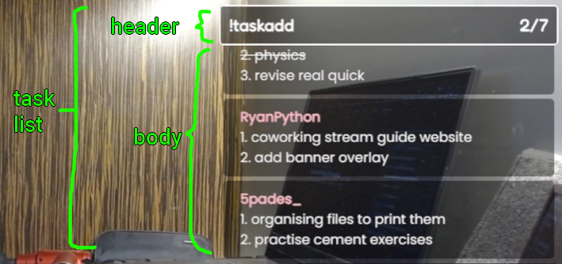

# Multi-Task widget Infinity (PRIVATE)

It's basically the same as the original "Multi-Task widget" but with infinite scroll! (more aesthetic, hehe)

## Logs

---

I'll just update you guys on the Discord

---

<!-- directory -->

## Content

-   [Multi-Task widget Infinity (PRIVATE)](#multi-task-widget-infinity-private)
    -   [Logs](#logs)
    -   [Content](#content)
    -   [Commands](#commands)
        -   [Moderators only](#moderators-only)
    -   [Installation](#installation)
        -   [Method 1 (fastest, easiest way)](#method-1-fastest-easiest-way)
        -   [Method 2 (better if you're using an alt account as a bot)](#method-2-better-if-youre-using-an-alt-account-as-a-bot)
    -   [Customization settings](#customization-settings)
        -   [settings](#settings)
        -   [task list styles](#task-list-styles)
        -   [header](#header)
        -   [body](#body)
        -   [task](#task)
    -   [Credits](#credits)

---

## Commands

### Moderators only

-   !clear - Clear all tasks
-   !cleardone - Clear all done tasks
-   !adel @user - Remove all tasks from a user

---

## Installation

### Method 1 (fastest, easiest way)

1. Install the zip or clone the repository

2. Go to https://twitchapps.com/tmi/ to create an oauth token (it acts as a password)

3. Setup authentication in `auth.js`

4. Setup `Browser Source` in OBS studio or other streaming software with the following settings:

-   Local File: `checked`
-   Local File: `index.html`

### Method 2 (better if you're using an alt account as a bot)

1. Install the zip or clone the repository

2. Create a Twitch application [here](https://dev.twitch.tv/console/apps) \(Log in with your alternate Twitch account if you wish to use a different account as a bot account\)

3. Copy the `Client ID` from the application

4. Create token using `get_token.txt`. Replace `CLIENT_ID` with the `Client ID` from the application

5. Setup authentication in `auth.js`

6. Setup `Browser Source` in OBS studio or other streaming software with the following settings:

-   Local File: `checked`
-   Local File: `index.html`

---

## Customization settings

Edit `configs.js` to edit the style of the task list

---

### settings

`showDoneTasks`:

**true**: show the done tasks

**false**: hide (and remove) the done tasks

`enableLimit`:

**true**: limit the number of incomplete tasks stored in the list

**false**: unlimited incomplete tasks

`limit`: The number of incomplete tasks to store in the list (integer)

`OneScrollPerMS`: Per MS, how many pixels to scroll (integer)

`pauseBetweenScrolls`: How many MS to pause between each end of the scroll (integer)

### task list styles

`taskListWidth`: width of the task list (px)

`taskListHeight`: height of the task list (px)

`taskListBackgroundColor`: background color of the task list (hex only)

`taskListBackgroundOpacity`: opacity of the task list background (0.0 - 1.0)

`taskListBorderWidth`: width of the task list border (px)

`taskListBorderColor`: color of the task list border (hex or name)

`taskListBorderRadius`: how round the task list border should be (px)

`taskListHorizontalPadding`: horizontal padding of the task list (px)

`taskListVerticalPadding`: vertical padding of the task list (px)

### header

`headerBackgroundColor`: background color of the header (hex only)

`headerBackgroundOpacity`: opacity of the header background (0.0 - 1.0)

`headerBorderWidth`: width of the header border (px)

`headerBorderColor`: color of the header border (hex or name)

`headerBorderRadius`: how round the header border should be (px)

`headerFontFamily`: font family of the header (font name)

`headerGoogleFont`: whether to use Google font for the header (true or false)

`headerFontSize`: font size of the header (px)

`headerFontWeight`: font weight of the header (normal, bold, or number)

`headerFontColor`: font color of the header (hex or name)

### body

`bodyBackgroundColor`: background color of the body (hex only)

`bodyBackgroundOpacity`: opacity of the body background (0.0 - 1.0)

`bodyBorderWidth`: width of the body border (px)

`bodyBorderColor`: color of the body border (hex or name)

`bodyBorderRadius`: how round the body border should be (px)

### task

`lineHeight`: line height of the task (number)

`usernameFontWeight`: font weight of the username (normal, bold, or number)

`usernameColor`: color of the username (hex or name or "" for Twitch user color)

`taskBackgroundColor`: background color of the task (hex only)

`taskBackgroundOpacity`: opacity of the task background (0.0 - 1.0)

`taskFontFamily`: font family of the task (font name)

`taskGoogleFont`: whether to use Google font for the task (true or false)

`taskFontSize`: font size of the task (px)

`taskFontColor`: font color of the task (hex or name)

`taskBorderColor`: color of the task border (hex or name)

`taskBorderWidth`: width of the task border (px)

`taskBorderRadius`: how round the task border should be (px)

`taskMarginBottom`: bottom margin of the task (px)

`taskHorizontalPadding`: horizontal padding of the task (px)

`taskVerticalPadding`: vertical padding of the task (px)

---

## Credits

**Author:** [**@RyanPython**](https://twitch.tv/RyanPython)

**Special thanks to:**

-   [**@Instafluff**](https://twitch.tv/Instafluff) \(for the Comfy JS library\)
